# 📝 Práctica 6 - Fetch API (Gestor de Posts)

Aplicación web que consume la API de JSONPlaceholder para gestionar posts (CRUD), utilizando JavaScript moderno y manipulación del DOM sin usar innerHTML.

---

## 🚀 Funcionalidades

-  Cargar posts desde API (GET)
-  Crear nuevos posts (POST)
-  Editar posts (PUT)
-  Eliminar posts (DELETE)
-  Buscar posts por título o contenido
-  Spinner de carga
-  Manejo de errores
-  Mensajes de éxito

---

## Tecnologías utilizadas

- HTML5
- CSS3
- JavaScript
- Fetch API
- JSONPlaceholder (API pública)

---

## 📸 Evidencias de funcionamiento

### 1. Datos cargados desde la API
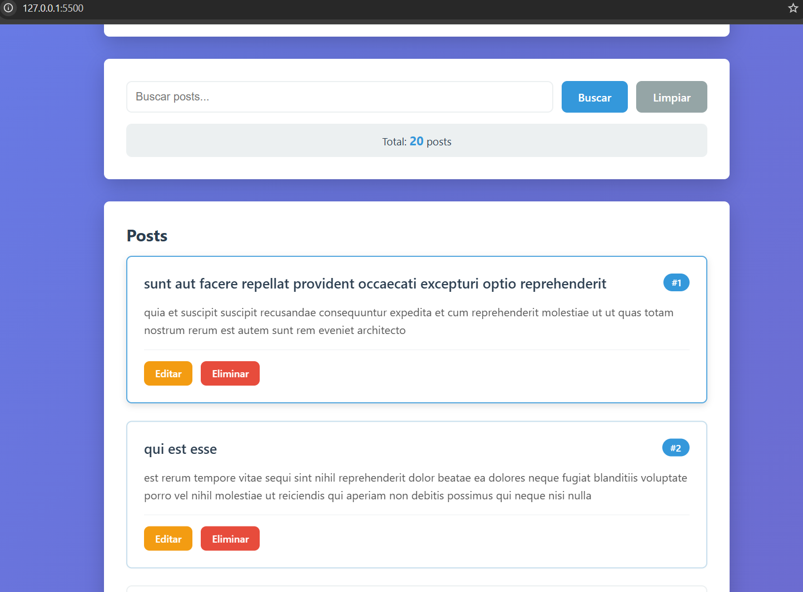  
**Descripción:** Se obtienen 20 registros desde la API JSONPlaceholder mediante una petición GET. Los datos se renderizan dinámicamente en la interfaz mostrando título, contenido e ID de cada post.

---

### 2. Spinner - Estado de carga
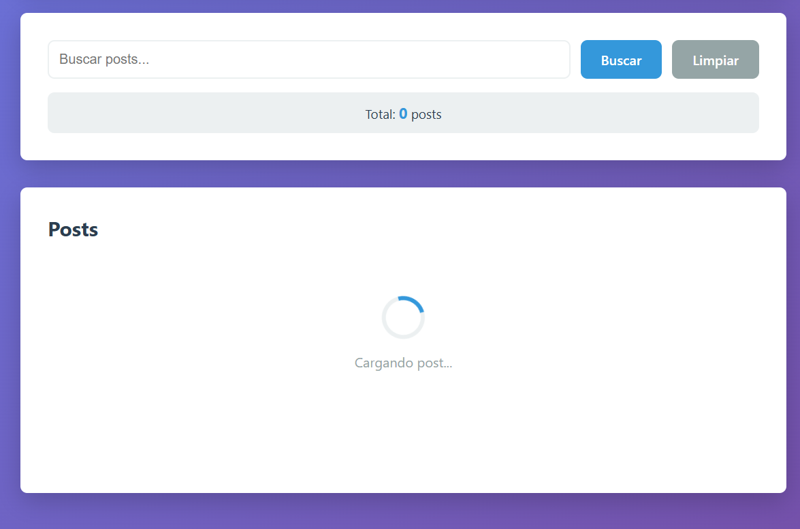  
**Descripción:** Se muestra un indicador visual de carga ("Cargando posts...") mientras se realiza la petición a la API, mejorando la experiencia del usuario.

---

### 3. Crear post
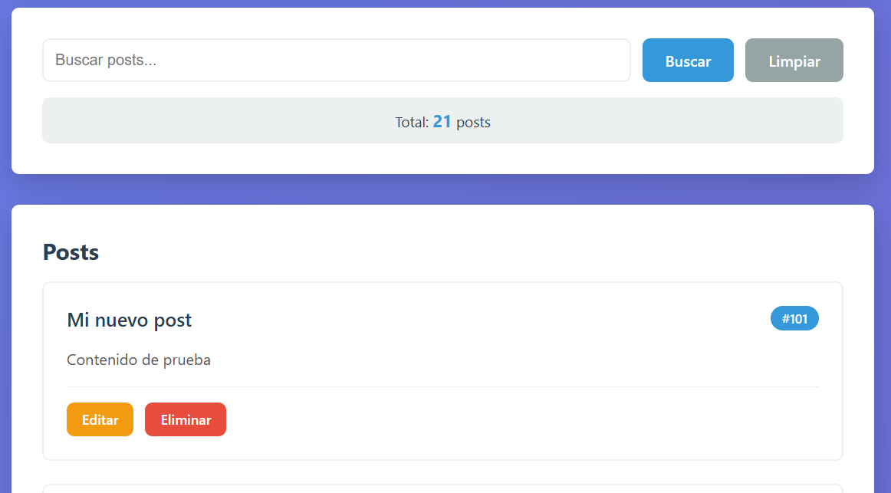  
**Descripción:** Se envía el formulario y se realiza una petición POST. El nuevo post se agrega dinámicamente a la lista con un ID generado (ej. 101).

---

### 4. Editar post
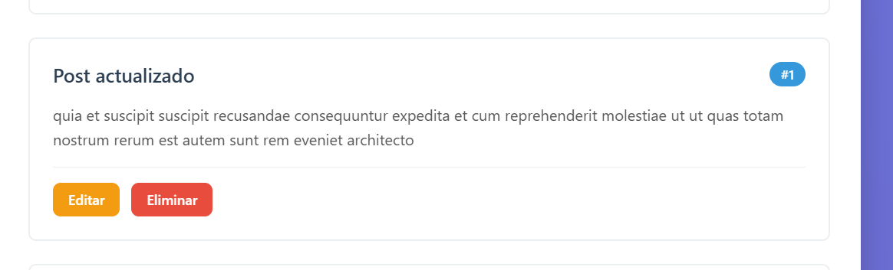  
**Descripción:** Se selecciona un post y se cargan sus datos en el formulario. Al actualizar, se realiza una petición PUT y los cambios se reflejan en la lista.

---

### 5. Eliminar post
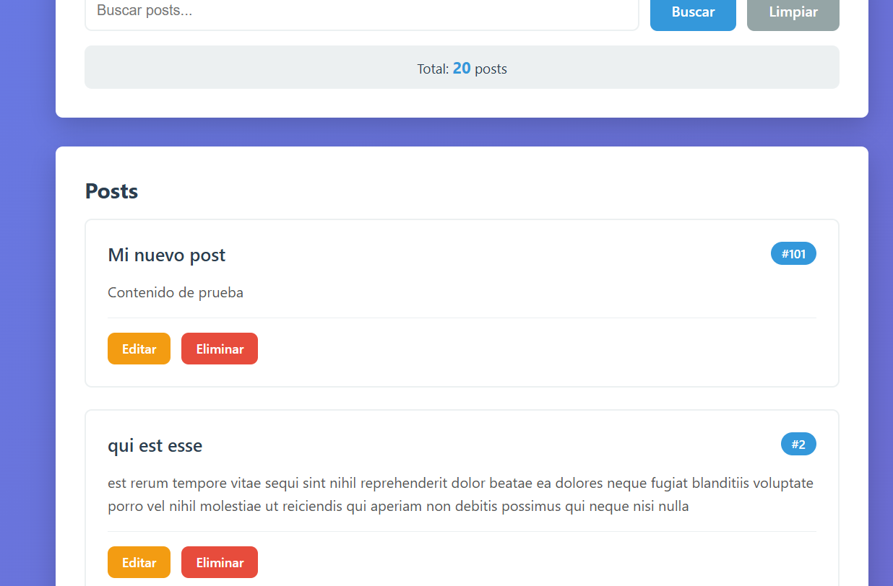  
**Descripción:** Se elimina un post mediante una petición DELETE. El elemento desaparece de la interfaz sin recargar la página.

---

### 6. Manejo de errores
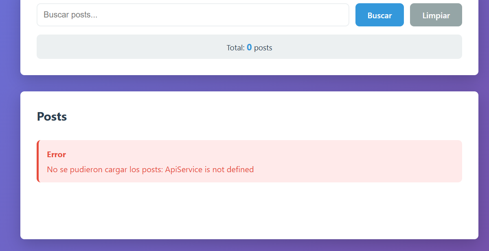  
**Descripción:** Se muestra un mensaje de error cuando falla una petición HTTP, permitiendo identificar problemas en la comunicación con la API.

---

### 7. DevTools Network
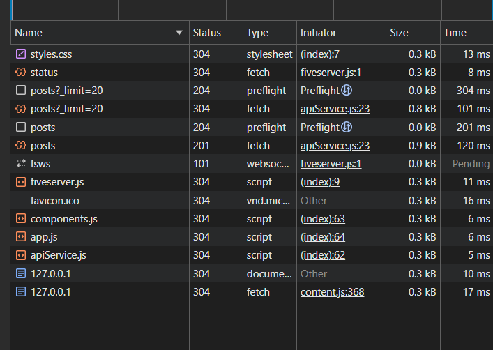  
**Descripción:** En la pestaña Network se observan las peticiones HTTP realizadas:
- GET /posts (carga de datos)
- POST /posts (creación)
- PUT /posts/{id} (actualización)
- DELETE /posts/{id} (eliminación)

---

## 💻 Evidencias de código

### 8. API Service (Fetch API)
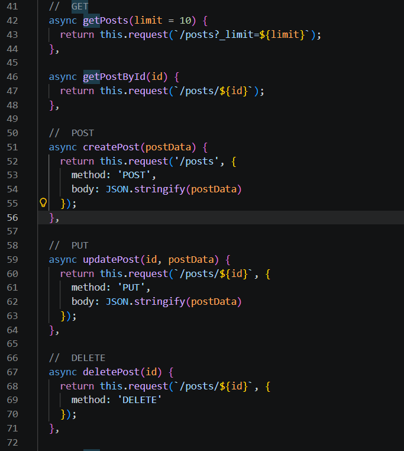  
**Descripción:** Implementación de funciones para consumir la API utilizando Fetch:
- getPosts (GET)
- createPost (POST)
- updatePost (PUT)
- deletePost (DELETE)

---

### 9. Componente PostCard
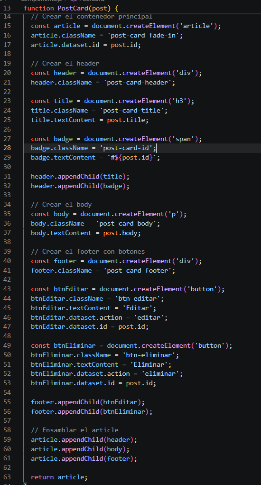  
**Descripción:** Componente que construye dinámicamente cada post usando createElement, sin utilizar innerHTML.

---

### 10. Spinner y manejo de errores
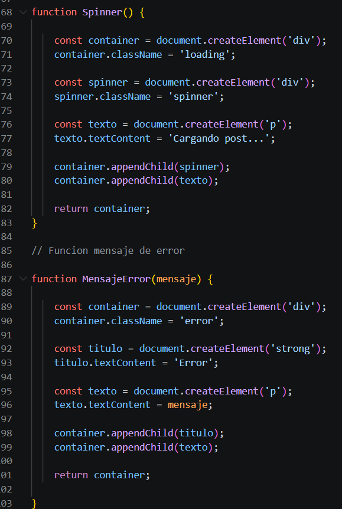  
**Descripción:** Componentes visuales para mostrar el estado de carga (Spinner) y errores en la aplicación.

---

### 11. Mensaje de éxito y renderizado
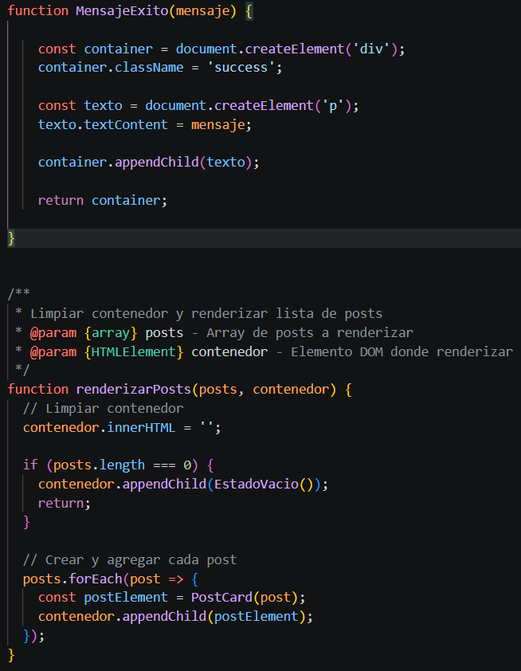  
**Descripción:** Se muestra un mensaje visual de éxito al crear, editar o eliminar un post. Además, se renderiza dinámicamente la lista actualizada.

---

##  Estructura del proyecto

PRACTICA-06/
│── assets/
│── css/
│ └── styles.css
│── js/
│ ├── apiService.js
│ ├── app.js
│ └── components.js
│── index.html

---

## Buenas prácticas implementadas

- Uso de Fetch API con async/await
- Manejo de errores con try/catch
- Manipulación del DOM sin innerHTML
- Uso de createElement, textContent y appendChild
- Separación de lógica (API, UI, lógica principal)

---

## API utilizada

https://jsonplaceholder.typicode.com/

---